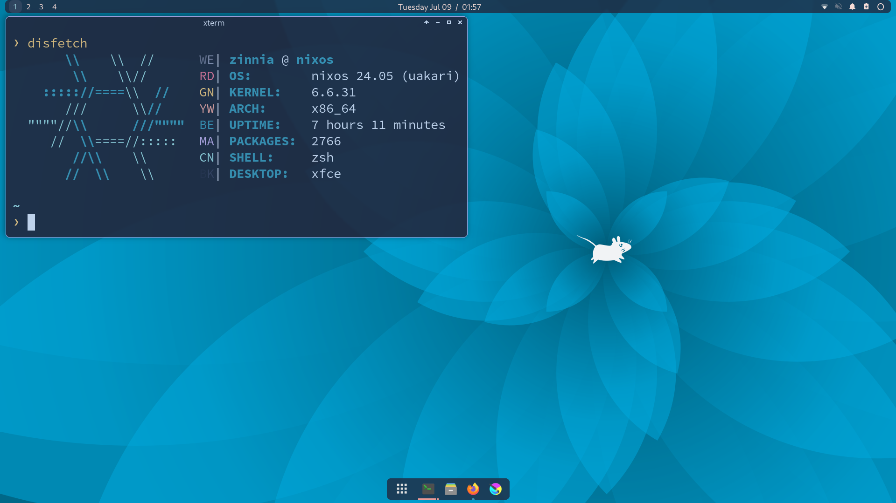

# mimvoid's nixos & home manager dotfiles

My config files, helpful resources, and some advice from my experience with NixOS.

#### Hyprland

![Screenshot: Hyprland with my custom fetcher fletchling and eza][i1]

![Screenshot: dooit with Tauon music player and Thunar file manager][i2]

![Screenshot: Ethereal jellyfish wallpaper by gracile with a notification saying "'pwease im dwowning' obama: then perish"][i3]

[i1]: assets/2024-11-27_hyprland-1.png
[i2]: assets/2024-11-27_hyprland-2.png
[i3]: assets/2024-11-27_hyprland-3.png

#### XFCE

- Firefox CSS: [panefox](https://github.com/mimvoid/panefox)
- Wallpapers (with credits): [wallpaper-stash](https://github.com/mimvoid/wallpaper-stash)
- Neovim config: [neovim-dots](https://github.com/mimvoid/neovim-dots)

## What I Use

Desktop Environments & Window Managers

- [Hyprland](https://hyprland.org)
- [XFCE][w1] with [xfwm][w2] & [cortile][w3]

Login Manager: [greetd][w4] with [tuigreet][w5]

[w1]: https://xfce.org
[w2]: https://docs.xfce.org/xfce/xfwm4/start
[w3]: https://github.com/leukipp/cortile
[w4]: https://sr.ht/~kennylevinsen/greetd
[w5]: https://github.com/apognu/tuigreet

| Applications    |                                    |
| --------------- | ---------------------------------- |
| Terminal        | [kitty][a1]                        |
| Editor          | [Neovim][a2] (with [nixPatch][a3]) |
| File manager    | [Thunar][a4] & [yazi][a5]          |
| Web browser     | [Firefox][a6]                      |
| Art program     | [Krita][a7]                        |
| Document viewer | [Zathura][a8]                      |
| To-do list      | [dooit][a9]                        |
| Music player    | [Tauon][a10]                       |

[a1]: https://sw.kovidgoyal.net/kitty
[a2]: https://neovim.io
[a3]: https://github.com/NicoElbers/nixPatch-nvim
[a4]: https://docs.xfce.org/xfce/thunar/start
[a5]: https://github.com/sxyazi/yazi
[a6]: https://firefox.com
[a7]: https://krita.org
[a8]: https://git.pwmt.org/pwmt/zathura
[a9]: https://github.com/dooit-org/dooit
[a10]: https://tauonmusicbox.rocks

| Hyprland-specific  |                                   |
| ------------------ | --------------------------------- |
| Lockscreen         | [hyprlock][h1]                    |
| Bar                | [AGS][h2]                         |
| Notifications      | [AGS][h2] ([mako][h3]-like style) |
| Logout menu        | [AGS][h2]                         |
| Launcher           | [fuzzel][h4]                      |
| Wallpaper          | [swww][h5]                        |
| Screen temperature | [wlsunset][h6]                    |
| Screenshot         | [hyprshot][h7]                    |
| Color picker       | [hyprpicker][h8]                  |

[h1]: https://wiki.hyprland.org/Hypr-Ecosystem
[h2]: https://github.com/Aylur/ags
[h3]: https://github.com/emersion/mako
[h4]: https://codeberg.org/dnkl/fuzzel
[h5]: https://github.com/LGFae/swww
[h6]: https://sr.ht/~kennylevinsen/wlsunset
[h7]: https://github.com/Gustash/hyprshot
[h8]: https://github.com/hyprwm/hyprpicker

| Theming               |                                                             |
| --------------------- | ----------------------------------------------------------- |
| GTK theme             | [Rose Pine][t1]                                        |
| Cursor                | [Rose Pine Dawn cursor][t2]                                 |
| Icons                 | [Papirus][t3] with [Catppuccin folders][t4] & [Adwaita][t5] |
| Sans serif font       | [Karla][t5]                                                 |
| Monospace font        | [0xProto][t6] ([Nerd Font][t7])                             |
| Display font          | [RitzFLF][t8]                                               |
| Colorscheme generator | [hellwal][t9]                                               |

[t1]: https://github.com/rose-pine/gtk
[t2]: https://github.com/rose-pine/cursor
[t3]: https://github.com/PapirusDevelopmentTeam/papirus-icon-theme
[t4]: https://github.com/catppuccin/papirus-folders
[t5]: https://gitlab.gnome.org/GNOME/adwaita-icon-theme
[t6]: https://github.com/googlefonts/karla
[t7]: https://github.com/0xType/0xProto
[t8]: https://www.nerdfonts.com
[t9]: https://moorstation.org/typoasis/designers/casady_greene/r_z.htm
[t10]: https://github.com/danihek/hellwal

- Krita
  - Theme: [Catppuccin Macchiato Maroon](https://github.com/catppuccin/kde)
  - Brushes & Resources
    - [Dirty Chalk for Children](https://krita-artists.org/t/dirty-chalk-for-children-free/39643)
    - [Hollow brush](https://krita-artists.org/t/i-made-a-hollow-brush/92064)
    - [SK Sketching](https://krita-artists.org/t/sk-sketching-in-krita-v1/45795)
    - [Rakurri Gradient Map Set](https://krita-artists.org/t/rakurri-gradient-map-set-free-gradient-maps/33381)
  - Plugins
    - [Shortcut Composer](https://github.com/wojtryb/Shortcut-Composer)
    - [Composition Helper](https://github.com/Grum999/CompositionHelper)
    - [Reference Tabs Docker](https://invent.kde.org/freyalupen/reference-tabs-docker)
    - [Timer Watch](https://github.com/EyeOdin/timer_watch)
- [Obsidian.md](https://obsidian.md) CSS snippets

## Other Cool Stuff

These are things I used that ended up not entirely fitting my use-case, but they're wonderful
nonetheless and I still recommend them.

- [foot](https://codeberg.org/dnkl/foot), lightweight terminal emulator for Wayland

## Resources

### Nix & NixOS Sources

#### Official

- [NixOS website](https://nixos.org)
- [Nix package manager & NixOS download](https://nixos.org/download)
  - The `nix-env` package manager works like most other package managers. However, I'd advise against it if you really want to get into Nix's declarative nature.
    - Unless all you want is just a good package manager
- [nix.dev](https://nix.dev), Nix ecosystem documentation
  - [Nix language guide](https://nix.dev/tutorials/nix-language)
- [Nixpkgs reference manual](https://nixos.org/manual/nixpkgs/stable)
- [NixOS wiki](https://wiki.nixos.org/wiki/NixOS_Wiki)
- Search
  - [Search Nix packages](https://search.nixos.org/packages)
  - [Search NixOS options](https://search.nixos.org/options)

#### Unofficial

- [Awesome Nix](https://github.com/nix-community/awesome-nix)
- Flakes
  - [NixOS & Flakes Book](https://nixos-and-flakes.thiscute.world)
  - [Very helpful guide to Nix flakes](https://nixos-and-flakes.thiscute.world/nixos-with-flakes/introduction-to-flakes)
  - Flakes may seem daunting at first, but they make it easier to add extra sources and configuration options. Plus, they're more declarative than Nix channels.
- [Nix User Repository (NUR)](https://nur.nix-community.org)
- [User-maintained NixOS wiki](https://nixos.wiki)
  - [Nix applications and ecosystem](https://nixos.wiki/wiki/Applications)
- [Remember to optimize your NixOS storage](https://www.reddit.com/r/NixOS/comments/1cunvdw/friendly_reminder_optimizestore_is_not_on_by)

### Home Manager

A declarative approach to configuring your user environment! It's like NixOS's configuration file, but only for the home directory. It's great if you want to tinker without adding a bunch of generations to your boot menu, or use different configurations for users on the same system.

It can work on other distros too. I tried it on openSUSE Tumbleweed, though not long-term.

- [Home Manager](https://github.com/nix-community/home-manager)
- [Manual](https://nix-community.github.io/home-manager)
  - [Configuration options](https://nix-community.github.io/home-manager/options.xhtml)
- [Search Home Manager options](https://home-manager-options.extranix.com)

### Extras

I mainly use NixOS and Home Manager, but here are some other interesting tools.

- [nh][em1], a pretty wrapper for rebuilding
- [NixVim][em2], for configuring Neovim and its plugins declaratively
  - [Documentation][em3]
- [Stylix][em5], for quick universal colorschemes and fonts
  - [Documentation][em6]
- [nix-flatpak][em4], for managing Flatpaks declaratively

[em1]: https://github.com/viperML/nh
[em2]: https://github.com/nix-community/nixvim
[em3]: https://nix-community.github.io/nixvim
[em5]: https://github.com/danth/stylix
[em6]: https://danth.github.io/stylix/options/nixos.html
[em4]: https://github.com/gmodena/nix-flatpak

## Pieces of Advice

NixOS works very differently to other Linux distros, but that's why I enjoy it!

- To locate an installed package's directory, use `nix path-info nixpkgs#<package-name>`.
  - It is _not_ fun to manually search through `/nix/store/` to find a specific package version.
- If you want a starter config, start small!
  - You can understand a lot by doing things yourself.
  - Configs that are too complex may confuse you out of changing them.
  - If you really want a config without the manual effort, NixOS is probably not for you.
- NixOS documentation truly is sparse.
  - To dig deep, don't be afraid to look through the source code and manuals.
  - You can do a ton on NixOS, but it takes time, effort, and undoubtly frustration.
- You don't need to rely on the options NixOS and Home Manager give you to create config files.
  - NixOS has `environment.etc."path/file.type"`, which creates `/etc/path/file.type`.
  - Home Manager has many:
    - `home.file."path/file.type"` creates `/home/user/path/file.type`.
    - `xdg.configFile."path/file.type"` creates `~/.config/path/file.type`.
      - (Unless your XDG config directory is somewhere else.)
  - You can use `"path/file.type".source = config.lib.file.mkOutOfStoreSymlink /absolute/path/to/file` to create a symlink.
    - Unlike the options above, it is not necessary to rebuild and switch for changes to take place.
  - Or create your own modules.

The beginning may be tough, but given enough time, navigating NixOS becomes second nature.
The declarative nature gives me piece of mind that nothing important is forgotten.
From development environments to custom packages, Nix is a wonderful piece of software!
