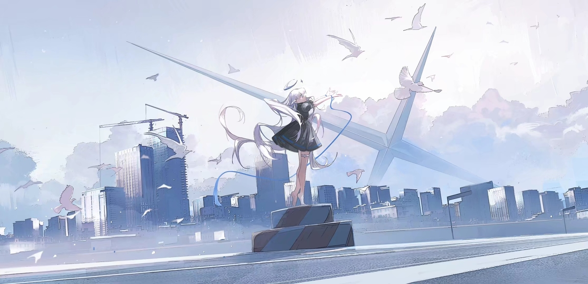

<h1 align="center">mimvoid's wallpaper stash</h1>

A collection of various wallpapers I've found!

Many of these were found through sources like Alpha Coders and Wallhaven, but I try my best to track down every artist. If I happen to have an illustration I don't know the artist of, but you do, please tell me and I will add it here.

File names are in the format: artist-name_title-name.filetype
- Title names in quotes are unofficial, and only used when none is known or there is no translation
- Names in parenthesis are the originals, next to their translations or unofficial title

## Artists

**Aeuna**: [Instagram](https://www.instagram.com/aeuna._/), [Twitter](https://x.com/byAeuna)

    

        <a href="https://x.com/byAeuna/status/1667749176443289600/photo/1">Under the Blue Sky 1</a>
    

    

    

        <a href="https://x.com/byAeuna/status/1667749176443289600/photo/4">Under the Blue Sky 4</a>
    

    

 

**Alena Aenami**: [Artstation](https://www.artstation.com/aenamiart)

    

        <a href="https://www.artstation.com/artwork/4bX4eY">Endless</a>
    

    

    

        <a href="https://www.artstation.com/artwork/Ya4WAb">Someday</a>
    

    

 

**Axle (鳥)**: [Pixiv](https://www.pixiv.net/en/users/8236670)

    

        <a href="https://www.pixiv.net/en/artworks/71328482">Autumn Colors (秋色)</a>
    

    

    

        <a href="https://www.pixiv.net/en/artworks/97618640">"birds"</a>
    

    

    

        <a href="https://www.pixiv.net/en/artworks/70458152">End of the Summer</a>
    

    

    

        <a href="https://www.pixiv.net/en/artworks/70142035">Summer (夏)</a>
    

    

 

**BAKAIRIS**: [Artstation](https://www.artstation.com/bakairis)

    

        <a href="https://www.artstation.com/artwork/YK8DNq">"rainy world" (亚特兰市郊)</a>
    

Edited version from JaKooLit's [Wallpaper Bank](https://github.com/JaKooLit/Wallpaper-Bank)

 

**Bastien Grivet**: [Artstation](https://www.artstation.com/grivetart)

    

        <a href="https://www.artstation.com/artwork/3WdYo">Ubaye Valley</a>
    

    

 

**Bis Biswas**: [Artstation](https://www.artstation.com/imbis), [DeviantArt](https://www.deviantart.com/bisbiswas)

    

        <a href="https://www.deviantart.com/bisbiswas/art/Abandoned-Cottage-949858161">Abandoned Cottage</a>
    

    

 

**DANGERDROP / ARQISAT**: [Tumblr](https://dangerdrop.tumblr.com/)

    

        <a href="https://dangerdrop.tumblr.com/post/140761882420/u620">"coffee </a>
        <a href="https://www.pixiv.net/en/artworks/55725854">roadtrip"</a>
    

    

 

**Elias Stern**: [Artstation](https://www.artstation.com/elias_stern)

    

        <a href="https://www.artstation.com/artwork/5DmxW">Sunrise Speed Panorama</a>
    

    

 

**Gracile**: [Landing page](https://lit.link/en/gracilejp), [website](https://www.gracile.jp)

    

        <a href="https://x.com/gracile_jp/status/1352278374903779329/photo/2">"blue 2"</a>
    

    

    

        <a href="https://x.com/gracile_jp/status/1352278374903779329/photo/4">"blue 4"</a>
    

    

    

        <a href="https://x.com/gracile_jp/status/1389577498862620673/photo/2">"branches"</a>
    

    

    

        <a href="https://wallhaven.cc/w/e7d368">"clouds"</a>
    

    
Original source unknown

    

    

        <a href="https://x.com/gracile_jp/status/1168895118784507910/photo/2">Edge of Summer</a>
    

    

    

        <a href="https://x.com/gracile_jp/status/1707043713552368033/photo/1">"grasses"</a>
    

    

    

        <a href="https://x.com/gracile_jp/status/1411382155498770433/photo/4">"small grasses"</a>
    

    

    

        <a href="https://x.com/gracile_jp/status1497202048840118277/photo/1">Jellyfish</a>
    

    

    

        <a href="https://x.com/gracile_jp/status/1356610926397558785/photo/3">"overgrown"</a>
    

    

    

        <a href="https://x.com/gracile_jp/status/1406328138607456258/photo/2">"over the clouds"</a>
    

    

    

        <a href="https://wallhaven.cc/w/ex2dol">Gracile? "savanna"</a>
    

    
Original source unknown

    

    

        <a href="https://x.com/gracile_jp/status/1789598350595293328">"twilight"</a>
    

    

 

**Han Yijie**: [Danbooru](https://danbooru.donmai.us/posts?tags=han_yijie)

    

        <a href="https://danbooru.donmai.us/posts/1847025?q=han_yijie">Departure (出航)</a>
    

    

 

**Sam Yang**: [Landing page](https://linktr.ee/samdoesarts)

    

        <a href="https://x.com/samdoesarts/status/1696555428228874444">Sunset</a>
    

    
Uncropped original unknown

    

 

**milkgrrl / Shari Coté**: [Website](https://www.milkgrrl.com/home)

    

        <a href="https://www.milkgrrl.com/portfolio?pgid=jja9jy5o-49abe1d5-7966-40a7-a66d-a163695ce767">Clouds</a>
    

    

 

    
Tokyo Shinjuku: original unknown

Edited version from JaKooLit's [Wallpaper Bank](https://github.com/JaKooLit/Wallpaper-Bank)

 

**XilmO**: [Pixiv](https://www.pixiv.net/en/users/19389056), [Artstation](https://www.artstation.com/yhl)

    

        <a href="https://www.pixiv.net/en/artworks/106047489">Mountain (山)</a>
    

    

***
If you're an artist and want your art removed, *please* don't hesitate to tell me. I will absolutely respect your wishes!
